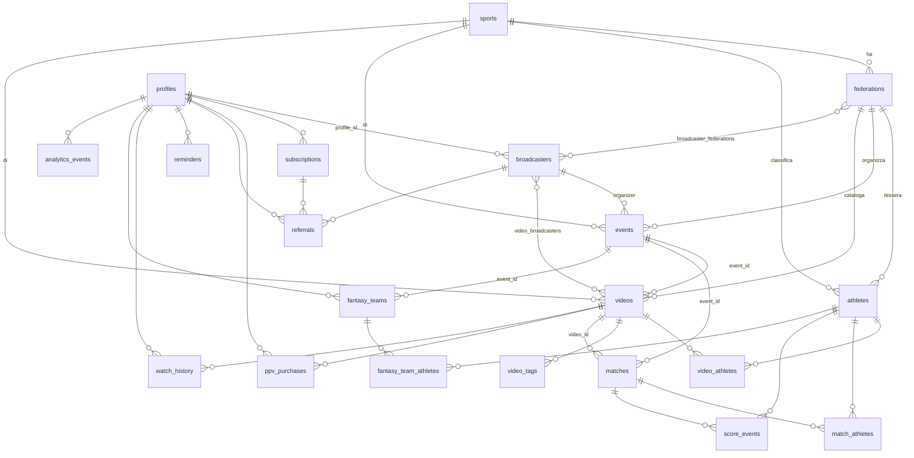

# SANDR — Modello dati: stato attuale vs gerarchia di arrivo

> Documento di **sola analisi**. Nessuna migrazione creata, nessuna tabella o codice modificato.
> Data: 2026-10-02 · Base: **`origin/main`** aggiornato (HEAD `f0fb6c0`).
> Citazioni: `supabase/migrations/NNNN:riga` per lo schema, `file:riga` per l'uso nel codice.
> Legenda: **[ESISTE]** · **[PARZIALE]** · **[ASSENTE]** · **[INUTILIZZATA]** (tabella creata ma non letta/scritta dall'app a runtime).

---

## 1. Cosa c'è oggi

### 1.1 Tabelle (scopo · colonne · FK · RLS · chi la usa)

Schema completo in `0001_complete_schema.sql` (22 tabelle) + estensioni 0005-0012. RLS abilitata su **tutte** (`0001:417-438`). Helper `is_admin()` / `current_user_role()` SECURITY DEFINER (`0001:330-350`).

| Tabella | Scopo | Colonne principali | FK | RLS | Usata da (file:riga) |
|---|---|---|---|---|---|
| **profiles** | Utente (estende `auth.users`) | `id`, `email`, `full_name`, `role`, `preferred_language`, `stripe_customer_id`, `referred_by`, +10 col. GDPR (`0009:11-21`) | →`auth.users`, `referred_by`→`broadcasters` (`0001:51,110-112`) | self read/update + admin manage (`0001:447-454`) | `guard.ts:16,49`, `access/server.ts:32`, `admin/actions.ts:20,32`, `user/actions.ts:26`, `tracking/actions.ts:99`, `videos/actions.ts:317`, `Navbar.tsx:70`, `/dashboard/profile`, `/settings`, `/subscription` |
| **sports** | Anagrafica sport | `id`, `name`, `slug`, `sort_order` | — | public read + admin write (`0001:458-460`) | `public/queries.ts:18,25`, `reference/actions.ts:52,250` (dropdown admin, sportsMap) |
| **federations** | Federazioni/enti (oggi usate anche come "circuiti") | `id`, `name`, `short_name`, `slug`, `nation`, `color`, `logo_url` | `sport_id`→`sports` (`0001:78`) | public read + admin write (`0001:462-464`) | `public/queries.ts:66,73`, `reference/actions.ts:60-166`, `/federations`, `/admin/federations`, landing |
| **broadcasters** | Broadcaster/organizzatori + referral/revenue-share | `name`, `slug`, `type`, `referral_*`, `*_revenue_share` | `profile_id`→`profiles` (`0001:93`) | public read + admin write (`0001:466-468`) | **[INUTILIZZATA]** (0 `.from`; referenziata solo dalla RLS `videos` `0001:521`) |
| **broadcaster_federations** | M:N broadcaster↔federazione | PK `(broadcaster_id, federation_id)` | →entrambe (`0001:116-117`) | public read + admin write (`0001:470-472`) | **[INUTILIZZATA]** |
| **athletes** | Atleti | `full_name`, `nation`, `nation_code`, `photo_url`, `ranking`, `season_points`, +`is_featured` (`0005`), +`birth_date` (`0008`) | `sport_id`, `federation_id`, `profile_id` (`0001:128-130`) | public read + admin write (`0001:474-476`) | `public/queries.ts:32-80`, `reference/actions.ts:70-238`, `/athletes`, `/admin/athletes` |
| **events** | **Evento/torneo/tappa (appiattiti)** | `title`, `slug`, `location`, `nation`, `start_date`, `end_date`, `stage` | `federation_id`, `sport_id`, `organizer_broadcaster_id` (`0001:143-145`) | public read + admin write (`0001:478-480`) | `events/actions.ts:27-73`, `public/queries.ts:103,124`, `/admin/events`, `/federations/[id]` |
| **videos** | Video Cloudflare Stream (VOD + flag live) | `cloudflare_uid`, `title`, `type`, `access_level`, `ppv_price`, `is_featured`, `is_live`, `status`, `view_count`, thumbnail_*, +`quality_level` (`0009`), +`thumbnail_mobile_url` (`0012`) | `sport_id`, `federation_id`, `event_id` (`0001:163-165`) | free/premium/ppv read + admin + broadcaster-own (`0001:486-530`) | `videos/actions.ts` (13×), `public/queries.ts:188`, `admin/actions.ts:42`, `api/stream/list-with-status:18`, player/VOD/home/admin |
| **video_broadcasters** | M:N video↔broadcaster (+`is_primary`) | PK `(video_id, broadcaster_id)` | →entrambe (`0001:183-184`) | public read + admin write (`0001:533-535`) | **[INUTILIZZATA]** (solo nella RLS `videos` per l'ownership broadcaster) |
| **video_athletes** | M:N video↔atleta | PK `(video_id, athlete_id)` | →entrambe (`0001:191-192`) | public read + admin write (`0001:536-538`) | `videos/actions.ts:86,178,220,275,461,464` (tag atleti, video per atleta) |
| **video_tags** | Tag liberi sui video | `video_id`, `tag` | `video_id`→`videos` (`0001:199`) | public read + admin write (`0001:539-541`) | `videos/actions.ts:84,278,470,473`, `reference/actions.ts:80` |
| **matches** | Partita + scorekeeping | `team_a_name`, `team_b_name`, `score_a/b`, `sets_a/b`, `status`, `scorekeeper_token`, `scheduled_at`, `started_at`, `ended_at` | `event_id`, `video_id` (`0001:206-207`) | public read + admin manage (`0001:547-549`) | **[INUTILIZZATA a runtime]** — letta solo via join in `getAthleteRecentMatches` (`public/queries.ts:153`), funzione **senza chiamanti** |
| **match_athletes** | Atleti del match, squadra A/B | PK `(match_id, athlete_id)`, `team char(1)` | →entrambe (`0001:225-226`) | public read + admin write (`0001:551-553`) | **[INUTILIZZATA a runtime]** — solo in `getAthleteRecentMatches` (dead) |
| **score_events** | Source of truth stats/fantasy | `match_id`, `team`, `athlete_id`, `type`, `set_number` | →`matches`, `athletes` (`0001:234-236`) | public read + admin manage (`0001:555-557`) | **[INUTILIZZATA]** |
| **subscriptions** | Abbonamenti Stripe | `plan`, `status`, `stripe_subscription_id`, `current_period_*`, +`trial_ends_at`/`is_trial` (`0006`) | `user_id`→`profiles` (`0001:245`) | self read (scrittura webhook/service role) (`0001:561-562`) | `access/server.ts:38`, `/subscription:67`, `admin/actions.ts:60`, `videos/actions.ts:318`; RLS `videos` premium (`0001:494`) |
| **ppv_purchases** | Acquisti pay-per-view | `amount`, `currency`, `valid_until`, `stripe_payment_id` | `user_id`→`profiles`, `video_id`→`videos` (`0001:259-260`) | self read (`0001:563-564`) | `access/server.ts:48`, `/subscription:76`; RLS `videos` ppv (`0001:507`) |
| **referrals** | Attribuzione ricavi referral | `commission_amount`, `status` | `user_id`, `broadcaster_id`, `subscription_id` (`0001:271-273`) | self read + admin manage (`0001:589-592`) | **[INUTILIZZATA]** |
| **reminders** | Promemoria evento/video | `remind_at`, `sent` | `user_id`, `video_id`, `match_id` (`0001:282-284`) | self manage (`0001:568-569`) | `user/actions.ts:81,101`, `/dashboard/reminders` |
| **watch_history** | Cronologia/continua a guardare | `watched_seconds`, `completed`, `last_watched_at`, UNIQUE `(user,video)`, +`dismissed` (`0011`) | `user_id`, `video_id` (`0001:293-294`) | self manage (`0001:566-567`) | `tracking/actions.ts:37,66`, `tracking/queries.ts:38,81`, `user/actions.ts:50`, `/watch-history`, continue-watching |
| **platform_settings** | Formule revenue/PPV (jsonb) | `key`, `value`, `description` | — | admin only (`0001:595-596`) | **[INUTILIZZATA]** (solo seed `0001:646-652`) |
| **fantasy_teams** | Fantasy game | `name`, `total_points` | `user_id`, `event_id` (`0001:312-313`) | self manage (`0001:570-571`) | **[INUTILIZZATA a runtime]** — solo `getMyFantasyTeams` (`user/actions.ts:115`), **senza chiamanti**; UI rimossa (`Navbar.tsx:156`) |
| **fantasy_team_athletes** | M:N fantasy↔atleta | PK `(fantasy_team_id, athlete_id)` | →entrambe (`0001:322-323`) | owner manage (`0001:574-585`) | **[INUTILIZZATA]** |
| **analytics_events** | Log eventi first-party (append-only) | `session_id`, `type`, `payload jsonb`, `video_id`, `athlete_id`, `federation_id` | `user_id`→`auth.users` (`0009:27-39`) | insert own/anon, select admin (`0009:49-60`) | `tracking/actions.ts:105` (insert, gated su `consent_profiling`) |

**RPC / trigger**: `handle_updated_at` su 8 tabelle (`0001:601-616`); `handle_new_user` (trigger signup, ridefinito `0009:71-105` per i consensi); `admin_add_enum_value` (`0002`, usato in `reference/actions.ts:267`); `increment_video_view` (`0010`, usato in `tracking/actions.ts:94`).
**Storage** (bucket pubblici, write solo admin): `video-thumbnails`, `athlete-photos`, `federation-logos` (`0004`, `0007`) — usati da `storage/actions.ts:63`, `ImageUpload.tsx`, `VideoMetadataForm.tsx:350`.
**Seed** (`0003`): 4 sport; 7 "federazioni" (FIPAV, AIBVC, AVP, BPT, CEV, King & Queen, Marathon); 8 atleti.

### 1.2 Diagramma relazioni (Mermaid erDiagram)

> Nota: le relazioni dei blocchi `matches/match_athletes/score_events` e `fantasy_*` esistono nello schema ma sono **inattive a runtime** (vedi §1.5).

### 1.3 Com'è strutturato oggi un "evento"

Un evento è **una singola riga piatta** in `events` (`0001:139-152`):
- **Contiene**: `title`, `slug`, `location` (testo), `nation`, `start_date`/`end_date` (range di date), `stage` (testo libero, es. fase/tappa).
- **Si lega a**: `federations` (`federation_id`), `sports` (`sport_id`), `broadcasters` (`organizer_broadcaster_id`). In senso inverso: `videos.event_id`, `matches.event_id`, `fantasy_teams.event_id` puntano all'evento.

Concetti della gerarchia di arrivo, **presenza oggi**:
- **Torneo / tappa**: [PARZIALE] — appiattiti in `events` + campo testo `stage`. Nessuna distinzione tra "serie ricorrente" e "singola edizione".
- **Campo di gioco**: **[ASSENTE]** — nessuna tabella; i match hanno solo `team_a_name`/`team_b_name`, nessun riferimento a un campo fisico.
- **Partita**: [ESISTE] in `matches` (con `scheduled_at`/`started_at`/`ended_at`, `status`), ma **non collegata a nessun campo** e inutilizzata a runtime.
- **Coppia (pair)**: **[ASSENTE]** — nessuna entità "coppia". Oggi: nomi squadra testuali su `matches` + `match_athletes` che associa singoli atleti alla squadra `A`/`B`. Nessuna nozione temporale di coppia che cambia nel tempo.
- **Set / punteggio**: [ESISTE] in `matches` (`score_a/b`, `sets_a/b`) + `score_events` (eventi punto/ace/muro/errore, `set_number`) — ma inutilizzati (la UI live mostra punteggi hardcoded).
- **Coordinate GPS, "volto" pro/open, profilo qualità video a livello evento/edizione, regole di diritti/visibilità per edizione, origine esterna (FIVB)**: **[ASSENTE]**. La qualità esiste solo come `videos.quality_level` (`0009`), l'accesso solo come `videos.access_level` (per-video, non per-edizione).

### 1.4 Divergenze `src/types/database.ts` ↔ migrazioni

`src/types/database.ts` è **scritto a mano** (dichiarato in testa, righe 1-6; non generato da `supabase gen types`).

- **Allineamento colonne: OK.** Tutte le 22 tabelle + 2 RPC (`admin_add_enum_value`, `increment_video_view`) sono dichiarate; tutte le colonne aggiunte dopo 0001 sono presenti: `consent_*` (0009), `nation_code`/`season_points`/`birth_date` (athletes), `thumbnail_mobile_url`/`quality_level` (videos), `trial_ends_at`/`is_trial` (subscriptions), `dismissed` (watch_history). *(verificato con grep sui nomi colonna)*
- **Divergenza di tipo (unica rilevata)**: `match_athletes.team` e `score_events.team` sono tipizzati **`team: string`** in `database.ts:531,536,560,569`, mentre il DB impone `team char(1) check (team in ('A','B'))` (`0001:227,235`). Il tipo TS è più lasco del vincolo reale.
- **Rischio strutturale**: essendo hand-maintained, ogni migrazione futura richiede aggiornamento manuale → drift non rilevabile dal type system. Nessuna `View` (schema senza viste). Le funzioni trigger/helper (`is_admin`, `current_user_role`, `handle_new_user`, `handle_updated_at`) non sono in `Functions` (corretto: non sono RPC chiamabili).

### 1.5 Tabelle create ma mai usate · dati usati senza tabella

**Tabelle [INUTILIZZATE] a runtime** (0 accessi dall'app, o solo via funzioni senza chiamanti):
- `broadcasters`, `broadcaster_federations`, `video_broadcasters` — nessun accesso applicativo; `broadcasters`/`video_broadcasters` compaiono solo dentro la RLS `videos` (ownership broadcaster). L'intero modello **broadcaster/revenue-share/referral** è schema-only.
- `referrals`, `platform_settings` — nessun accesso (`platform_settings` solo seedata).
- `matches`, `match_athletes`, `score_events` — raggiungibili solo da `getAthleteRecentMatches` (`public/queries.ts:149`), **funzione senza chiamanti** → blocco scorekeeping/stats interamente dormiente.
- `fantasy_teams`, `fantasy_team_athletes` — raggiungibili solo da `getMyFantasyTeams` (`user/actions.ts:112`), **senza chiamanti**; UI fantasy rimossa (`Navbar.tsx:156`, `user/types.ts:26` "kept for future FantaBeach integration").

**Dati usati senza tabella (mock/hardcoded)** — file `src/lib/mock-*.ts` (620 righe tot.):
- **Dirette live**: `/live` e `/live/[id]` usano `mock-content.ts` (3 live fittizi, `:6-50`); nessun playback live reale da DB.
- **Chat live**: `SEED_CHAT` hardcoded in `live/[id]/page.tsx`.
- **Statistiche/punteggio live**: `SIDEBAR_STATS` hardcoded — nonostante esistano `matches`/`score_events` inutilizzate.
- **Quote betting (Bet365)**: odds hardcoded in `live/[id]`.
- **Preferiti**: `/dashboard/favorites` è mock (nessuna tabella `favorites`).
- **Fallback catalogo**: `mock-athletes.ts`, `mock-federations.ts`, `mock-content.ts` usati come fallback quando Supabase è vuoto/non configurato (home, landing, athletes, federations).
- **"Coppia"**: concetto usato nella UI (nomi squadra "Lupo/Nicolai") ma senza entità dedicata.

---

## 2. La gerarchia decisa (modello di arrivo)

Sintesi del modello obiettivo, per riferimento del confronto §3:

1. **Federazione** (FIPAV, AIBVC, FIVB…)
2. **Circuito** — tour o categoria di una federazione
3. **Serie** — evento ricorrente (es. "Tappa di Bibione", torna ogni anno)
4. **Edizione** — singola occorrenza: date, luogo, **GPS**, **volto** ("pro" | "open"), **profilo qualità video**, **regole diritti/visibilità**
5. **Campo** — campo di gioco di quell'edizione
6. **Partita** — coppia vs coppia: orario previsto, inizio/fine effettivi, set e punteggio
7. **Atleta** e **Coppia** (le coppie cambiano nel tempo)
8. **Postazione** — telefono o regia esterna, con **chiave di trasmissione**; tipo "telefono app" | "regia esterna RTMP/SRT"
9. **Assegnazione** — postazione su un campo per una finestra oraria (collega la diretta a campo+partita; l'operatore sceglie il **campo**, mai la partita)
10. **Speaker** — commentatore assegnato a una partita (max 2), in campo o remoto
11. **Origine** su ogni entità importabile: `"sandr" | "fivbeach" | "organizzatore"` + **id esterno** (es. id FIVB VIS), per il calendario internazionale da fivbeach.com.

---

## 3. Confronto gerarchia ↔ schema attuale

| Entità target | Stato | Tabella attuale / gap | Azione suggerita |
|---|---|---|---|
| **Federazione** | [ESISTE] | `federations` (`0001:73`) | Mantenere. Pulire il doppio ruolo "federazione vs circuito" (oggi i tour tipo BPT/AIBVC sono righe `federations`). |
| **Circuito** | **[ASSENTE]** come entità | Oggi è una riga `federations` e/o `events.stage` | Nuova tabella `circuits (federation_id FK)`; migrare i "tour" da `federations`. |
| **Serie** (ricorrente) | **[ASSENTE]** | — | Nuova tabella `series (circuit_id FK)`. |
| **Edizione** | [PARZIALE] | `events` (`0001:139`) è la cosa più vicina: date/location/stage | Rinominare concettualmente `events`→`editions` (o aggiungere `series_id`); aggiungere `lat/lng`, `face/volto` (pro/open), `quality_profile`, `rights`/`visibility`. |
| **Campo** | **[ASSENTE]** | — | Nuova tabella `courts (edition_id FK)`. |
| **Partita** | [ESISTE] (inattiva) | `matches` (`0001:204`) con set/punteggio/orari | Mantenere; aggiungere `court_id` e `pair_a_id`/`pair_b_id`; attivarla (oggi dead code). |
| **Atleta** | [ESISTE] | `athletes` (`0001:122`) | Mantenere. |
| **Coppia** | **[ASSENTE]** | Oggi `match_athletes` (atleta→team A/B) + nomi testuali | Nuova tabella `pairs` (temporale, athlete1/athlete2 + validità); `matches` referenzia le coppie; valutare dismissione di `team_a_name/b_name` testuali. |
| **Postazione** | **[ASSENTE]** | `matches.scorekeeper_token` è per lo **scorekeeping**, non lo streaming; `videos.cloudflare_uid` è post-upload | Nuova tabella `ingest_stations` (type telefono/RTMP-SRT, stream_key). **AREA CRITICA** (chiavi di trasmissione). |
| **Assegnazione** | **[ASSENTE]** | — | Nuova tabella `assignments` (station↔court↔finestra oraria). |
| **Speaker** | **[ASSENTE]** | — | Nuova tabella `match_speakers` (max 2, in campo/remoto). |
| **Origine + id esterno** | **[ASSENTE]** ovunque | Nessuna colonna `source`/`external_id` (verificato: 0 occorrenze) | Aggiungere `source` + `external_id` (+ `external_system`) alle entità importabili (federations, circuits, series, editions, athletes, pairs, matches). |

**Da rinominare / unire / dismettere (tabelle attuali):**
- **`events`** → diventa il livello **Edizione** (con sopra `circuits`+`series`). Oggi conflà torneo+tappa.
- **`federations`** → mantenere, ma separare il concetto "circuito" che vi è stato sovrapposto nel seed.
- **`matches`** → mantenere e **attivare**; collegare a `courts` e `pairs`.
- **`match_athletes`** → potenzialmente assorbito da `pairs` + `match_pairs` (le coppie sostituiscono l'assegnazione atleta→team).
- **`broadcasters` / `broadcaster_federations` / `video_broadcasters` / `referrals` / `platform_settings`** → oggi inutilizzate: decidere se **tenere per il modello revenue futuro** o **dismettere** finché non servono (YAGNI).
- **`fantasy_teams` / `fantasy_team_athletes` / `score_events`** → dormienti: tenere come base stats/fantasy o dismettere.
- **Postazioni / assegnazioni / speaker / chiavi** → probabilmente **non** in questo DB catalogo ma nel backend dirette (vedi Opzione C).

---

## 4. Tre opzioni (senza scegliere)

### Opzione A — Creare tutta la gerarchia ora in Supabase (nuove migrazioni)
Nuove tabelle: `circuits`, `series`, (rinomina/estensione `events`→edizioni), `courts`, `pairs`, `match_pairs`, `ingest_stations`, `assignments`, `match_speakers` + colonne `source`/`external_id` ovunque, + RLS per ciascuna.
- **Lavoro**: alto (~9-12 tabelle nuove/modificate, RLS, indici, backfill dei dati seed/`federations`→`circuits`, aggiornamento `database.ts` a mano, refactor delle query `events`/`videos`).
- **Rischi**: schema disegnato prima che i flussi dirette siano definiti → probabile rilavorazione; le chiavi di trasmissione (AREA CRITICA) finiscono in Supabase; migrazione dati esistenti (`events`, seed `federations`). Rischio di over-engineering (viola YAGNI finché le dirette non sono pronte).
- **Se il catalogo migra su Laravel+MySQL**: rilavorazione **massima** — tutte le migrazioni Postgres/RLS andrebbero riscritte come migration Laravel + policy applicative; enum Postgres → enum/lookup MySQL; la logica RLS andrebbe reimplementata a livello applicativo.

### Opzione B — Solo tipi TypeScript + dati mock nel frontend (tabelle dopo)
Definire la gerarchia come `types/` + mock (sulla falsariga di `mock-*.ts`), creare le tabelle quando il backend è deciso.
- **Lavoro**: basso-medio (tipi + mock + mapping UI); nessuna migrazione.
- **Rischi**: doppia fonte di verità temporanea (mock vs DB reale già esistente per federazioni/atleti/eventi); rischio che il frontend si modelli su strutture che poi il backend non rispetta; i dati reali già in `events`/`federations` resterebbero scollegati dai nuovi tipi.
- **Se il catalogo migra su Laravel+MySQL**: rilavorazione **minima** sul lato dati (nessuno schema buttato); va rifatto solo il wiring quando arriva il backend. È l'opzione che "impegna" di meno.

### Opzione C — Ibrido (consigliabile da valutare): catalogo in Supabase, dirette al backend streaming
In Supabase solo ciò che serve **subito al catalogo**: `federations`, `circuits`, `series`, `editions` (da `events`), `courts`, `matches`, `athletes`, `pairs` (+`source`/`external_id`). **Postazioni, assegnazioni, chiavi di trasmissione e speaker restano al backend delle dirette** (non in Supabase).
- **Lavoro**: medio (~6-7 tabelle catalogo + colonne origine; niente ingest/streaming nel DB catalogo).
- **Rischi**: serve un confine chiaro catalogo↔dirette (come si collega una diretta a `matches`/`courts` via API); due sistemi da tenere in sync. Ma isola l'AREA CRITICA (chiavi RTMP/SRT) fuori dal catalogo pubblico.
- **Se il catalogo migra su Laravel+MySQL**: rilavorazione **media ma contenuta** — si sposta solo il blocco catalogo; il backend dirette (dove vivono postazioni/assegnazioni/chiavi) è già separato e non viene toccato. Buon compromesso rispetto al rischio "cambio backend".

---

## 5. Domande prima di scrivere le migrazioni

1. **Circuito vs Federazione**: i "tour" oggi seedati come `federations` (BPT, AIBVC, King & Queen, Marathon) vanno migrati in una nuova `circuits` sotto la federazione madre (es. FIVB→BPT)? Qual è la mappatura federazione→circuiti che vuoi?
2. **Serie vs Edizione**: confermi che `events` diventa l'**Edizione** e che aggiungiamo un livello **Serie** ricorrente sopra? Un'edizione appartiene sempre a una serie, o possono esistere edizioni "one-off" senza serie?
3. **Edizione — campi**: quali esattamente su ogni edizione? (lat/lng GPS, volto `pro|open`, profilo qualità video, regole diritti/visibilità). Le "regole diritti/visibilità" sostituiscono/si sommano a `videos.access_level`?
4. **Volto "pro"/"open"**: cosa cambia a livello dati tra i due (qualità, campi obbligatori, diritti)? È un enum sull'edizione o anche sulla singola partita?
5. **Coppia**: modello temporale desiderato — una `pair` ha `athlete1_id`, `athlete2_id`, `valid_from`/`valid_to`? Cosa fare dei match storici con sole stringhe `team_a_name`?
6. **Dirette (postazioni/assegnazioni/chiavi/speaker)**: stanno in Supabase (Opzione A) o in un backend dirette separato (Opzione C)? Questo decide se le chiavi RTMP/SRT entrano nel DB catalogo (AREA CRITICA).
7. **Backend futuro**: il catalogo potrebbe spostarsi su **Laravel + MySQL**? Se sì, pesa a favore dell'Opzione B/C e sconsiglia di investire in RLS Postgres complesse ora.
8. **fivbeach.com / FIVB VIS**: che formato hanno gli id esterni e quali entità arrivano dall'import (solo edizioni/calendario? anche atleti/coppie/risultati)? Serve un campo `external_system` oltre a `source`?
9. **Tabelle inutilizzate** (`broadcasters`, `referrals`, `video_broadcasters`, `score_events`, `fantasy_*`, `platform_settings`): tenere come base per il futuro o dismettere ora (YAGNI)? Il modello revenue-share/referral è ancora previsto?
10. **Scorekeeping**: `matches`/`score_events` esistono ma sono dormienti e la UI live usa stats hardcoded. Vuoi attivare il modello esistente o ridisegnarlo con la nuova gerarchia (campi/coppie)?
11. **`database.ts`**: continuiamo a mantenerlo a mano o passiamo a `supabase gen types` per eliminare il rischio di drift (e sistemare `team: string`→`'A'|'B'`)?

---

*Fine analisi. Nessuna migrazione, tabella o codice modificati, come richiesto.*
